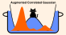

.. DoubleWell documentation master file, created by
   sphinx-quickstart on Wed Sep 16 10:49:58 2026.
   You can adapt this file completely to your liking, but it should at least
   contain the root `toctree` directive.

DoubleWell documentation
========================

.. toctree::
   :maxdepth: 1
   :caption: Contents:

   README.md
   files
   Acknowledgements.md

DoubleWell Files
==========================================

You find the repository `here <https://>`_

The paper is submitted

License
========
This project is distributed under the MIT License. See the
`LICENSE <https://github.com//GiacomoBotti/DoubleWell/blob/main/LICENSE>`_
file for details.
